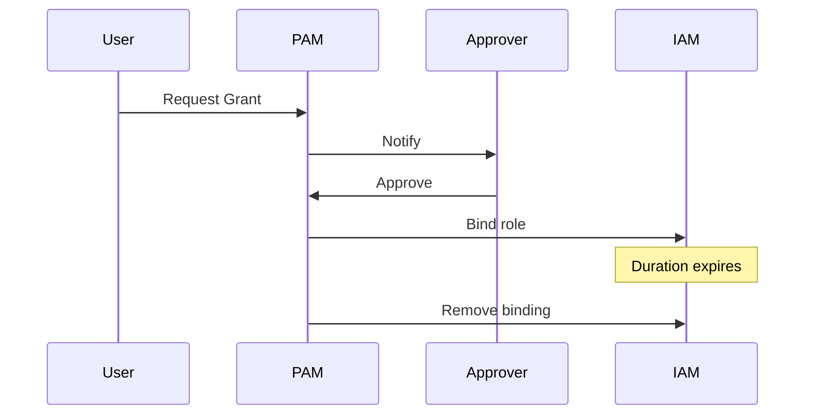

There is often a tension between security teams who wish to reduce the scope of access to sensitive resources and 
engineering teams who (reasonably) want to move quickly so want to do the opposite. Over time this leads to an accrual of excess permissions that are actually only needed for very short periods of time.  But what if there were a better way to manage access to sensitive resources in GCP... Enter [Privileged Access Manager (PAM)](https://docs.cloud.google.com/iam/docs/pam-overview).

PAM is a service that allows us to reduce standing access to sensitive resources by granting access only when needed, for a limited amount of time. It provides a centralised way for users to request and grant access directly in GCP without relying on third party tooling. 

## Why would I want to use this?

You might not! This may not be a control you need and it depends on the threat model and security requirements of your organisation, but some common reasons are:

- Reducing the risk of accidental or malicious access to sensitive resources in the case of a compromised developer account
- Providing an audit trail of all access requests to meet compliance requirements (e.g. PCI-DSS)
- Allowing for break-glass access in case of emergency
- Implementing Multi-party authorisation workflows (Team A needs to approve Team B's request before granting)

## The Good

- included in GCP
- can be configured as code using Terraform
- gives an audit log of every privileged access request
- simple to set up


## Not so good

- Doesn't work cross cloud
- Built in notification system is email based (plan to improve on this with a tool I am working on)
- Adds some developer friction versus just granting access all the time


## Core concepts

There are two main concepts in GCP PAM, Entitlements and Grants.

### Entitlements

Entitlements define which principals (user, service account, group) can request access to specific roles and for how long. Optionally they can specify an approver team or user.

### Grants

Grants are time bound instantiations of an Entitlement for a specific principal.


### Access Request Flow



## Setting up PAM with Terraform

The following is an example showing how to setup PAM in GCP with terraform, it creates an entitlement allowing developers to request access to the editor role for a project, with approval required from a separate group.

### Enable the API

```hcl
resource "google_project_service" "pam" {
  project = var.project_id
  service = "privilegedaccessmanager.googleapis.com"
}
```

### Create an Entitlement

```hcl
resource "google_privileged_access_manager_entitlement" "example" {
  entitlement_id       = "example-entitlement"
  location             = "global"
  max_request_duration = "3600s"
  parent               = "projects/${var.project_id}"

  privileged_access {
    gcp_iam_access {
      role_bindings {
        role = "roles/editor"
      }
      resource      = "//cloudresourcemanager.googleapis.com/projects/${var.project_id}"
      resource_type = "cloudresourcemanager.googleapis.com/Project"
    }
  }

  eligible_users {
    principals = ["group:developers@example.com"]
  }

  approval_workflow {
    manual_approvals {
      require_approver_justification = true
      steps {
        approvers {
          principals = ["group:approvers@example.com"]
        }
        approvals_needed = 1
      }
    }
  }

  requester_justification_config {
    unstructured {} # this can also be set to not_mandatory
  }
}
```

## Requesting Access

```bash
gcloud beta pam grants create \
  --entitlement=example-entitlement \
  --requested-duration="1800s" \
  --justification="Investigating production issue or ticket #12345" \
  --location=global
```

## Best Practices

- Allow self approval to start with (or forever if it meets your security requirements)
- Start small (either small group of users or roles) and gradually expand as you build trust in the system.
- Require a justification for break glass requests, but avoid overusing if not required.
- Start with broadly scoped access then use Policy analyser to refine.


## Resources

- [GCP PAM Documentation](https://cloud.google.com/iam/docs/pam-overview)
- [Terraform Registry - PAM Entitlement](https://registry.terraform.io/providers/hashicorp/google/latest/docs/resources/privileged_access_manager_entitlement)
